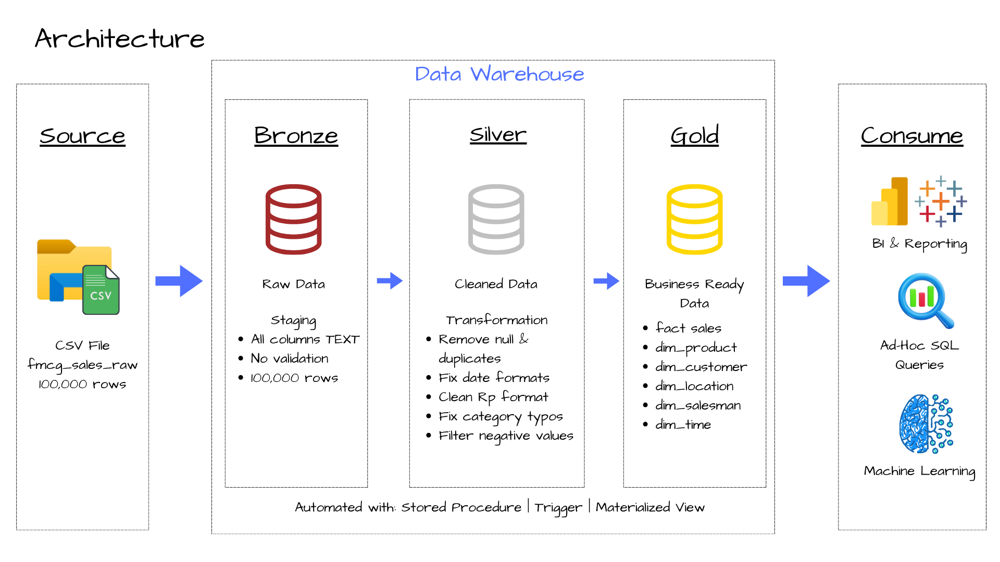
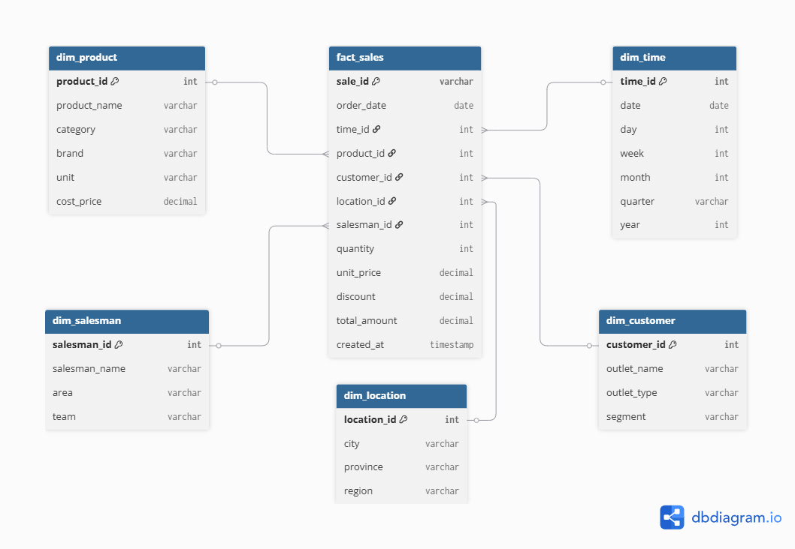

# FMCG Sales Data Warehouse | PostgreSQL | Medallion Architecture

A end-to-end data warehouse project built with **PostgreSQL** using **Medallion Architecture** (Bronze - Silver - Gold), simulating a real-world FMCG distribution data pipeline.

---

## Project Overview

In FMCG distribution, sales data often arrives in raw and inconsistent 
formats from multiple salesman across different regions — making it 
difficult for management to get a clear picture of business performance.

This project builds a centralized **Data Warehouse** using Medallion 
Architecture to solve that challenge:

- **Bronze layer** ingests 100,000 raw transactions and preserves them as-is
- **Silver layer** cleans and resolves 6 types of data quality issues 
  including inconsistent date formats, Rp-formatted amounts, NULL values, 
  category typos, negative values, and duplicates
- **Gold layer** organizes clean data into a Star Schema, enabling fast 
  and reliable analysis of revenue trends, product performance, and 
  regional sales across 10 cities in Indonesia

The entire pipeline runs automatically with a **single stored procedure call**, 
while a trigger ensures every change to the fact table is fully audited.

---

## Architecture



| Layer | Description |
|-------|-------------|
| **Bronze** | Raw data ingestion, all columns TEXT, no validation |
| **Silver** | Cleaned and transformed data |
| **Gold** | Business-ready star schema |

---

## Star Schema



---

## Dataset Overview

| Attribute | Details |
|-----------|---------|
| Total Rows | 100,000 |
| Clean Rows | 98,000 |
| Period | January - December 2024 |
| Products | 20 unique products |
| Outlets | 20 unique outlets |
| Salesman | 15 unique salesman |
| Cities | 10 cities across Indonesia |

### Data Quality Issues

| Issue | Rows | Solution |
|-------|------|----------|
| Inconsistent date format | 1,500 | CASE WHEN + TO_DATE() |
| Amount with Rp format | 1,500 | REPLACE() + CAST |
| Category typos | 1,000 | CASE product_name mapping |
| NULL values | 1,000 | WHERE IS NOT NULL |
| Negative values | 500 | WHERE quantity NOT LIKE '-%' |
| Duplicate rows | 500 | ON CONFLICT DO NOTHING |

---

## Automation

### Stored Procedure

```sql
CALL gold.load_fmcg_pipeline();
```
```
Step 1: Validate staging table is not empty
Step 2: Load and transform Bronze to Silver
Step 3: Load Silver to Gold
Step 4: Refresh Materialized Views
Step 5: Truncate staging table
```
### Trigger

| Operation | Recorded |
|-----------|----------|
| INSERT | New values |
| UPDATE | Old and new values |
| DELETE | Old values |

### Materialized Views

| View | Description |
|------|-------------|
| mv_sales_by_month | Monthly sales trend |
| mv_sales_by_product | Product performance |
| mv_sales_by_region | Regional performance |

---

## How to Run

### Prerequisites
- PostgreSQL 14+
- DBeaver

### Steps

**1. Create database**
```sql
CREATE DATABASE fmcg_dw;
```

**2. Run scripts in order**
```
scripts/00_setup/01_create_schemas.sql
scripts/01_bronze/01_bronze_staging.sql
scripts/02_silver/01_silver_ddl.sql
scripts/03_gold/01_gold_ddl.sql
scripts/04_automation/01_stored_procedure.sql
scripts/04_automation/02_trigger.sql
scripts/04_automation/03_materialized_view.sql
```
**3. Load raw data**
```sql
COPY bronze.staging_sales (
    sale_id, order_date, salesman_name, salesman_area, salesman_team,
    outlet_name, outlet_type, outlet_segment, city, province, region,
    product_name, brand, category, unit, cost_price, quantity,
    unit_price, discount, total_amount
)
FROM 'your/path/to/dataset/fmcg_sales_raw.csv'
WITH (FORMAT csv, HEADER true, DELIMITER ',');
```

**4. Run pipeline**
```sql
CALL gold.load_fmcg_pipeline();
```

---

## Project Structure
```
sql-data-warehouse-project/
├── images/
│   ├── architecture.png
│   └── data_model.png
├── scripts/
│   ├── 00_setup/
│   │   └── 01_create_database_and_schemas.sql
│   ├── 01_bronze/
│   │   └── 01_bronze_staging.sql
│   ├── 02_silver/
│   │   ├── 01_silver_ddl.sql
│   │   └── 02_silver_transform.sql
│   ├── 03_gold/
│   │   ├── 01_gold_ddl.sql
│   │   └── 02_gold_load.sql
│   └── 04_automation/
│       ├── 01_stored_procedure.sql
│       ├── 02_trigger.sql
│       └── 03_materialized_view.sql
├── dataset/
│   └── fmcg_sales_raw.csv
└── README.md
```
---

## Key Concepts Demonstrated

- **Medallion Architecture** - Bronze, Silver, Gold data layers
- **Star Schema** - Fact and dimension tables design
- **ETL Pipeline** - Extract, Transform, Load process
- **Data Cleaning** - Handling 6 types of real-world messy data
- **Upsert** - INSERT ON CONFLICT for idempotent pipeline
- **Stored Procedure** - Single command pipeline automation
- **Trigger** - Automatic audit logging on fact table
- **Materialized View** - Pre-aggregated reporting layer
- **Indexing** - Query performance optimization

---

## Tech Stack

| Tool | Version | Purpose |
|------|---------|---------|
| PostgreSQL | 16 | Database and query engine |
| DBeaver | 24.x | Database client and query editor |

---

## Author

Built as a data engineering portfolio project to demonstrate end-to-end data warehouse implementation using PostgreSQL.
